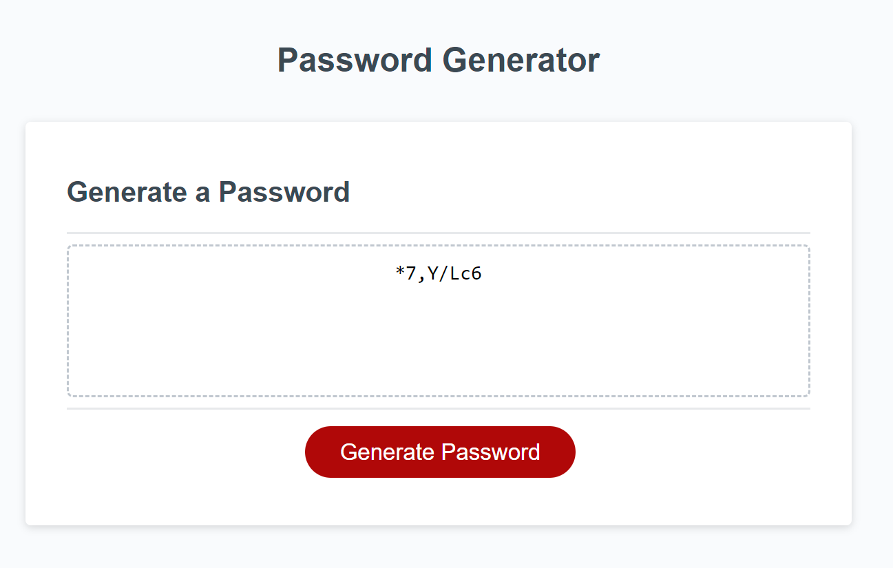

# 03-password-generator

## Description
html, css and js for random password generator

GIVEN I need a new, secure password
WHEN I click the button to generate a password
THEN I am presented with a series of prompts for password criteria
WHEN prompted for password criteria
THEN I select which criteria to include in the password
WHEN prompted for the length of the password
THEN I choose a length of at least 8 characters and no more than 128 characters
WHEN asked for character types to include in the password
THEN I confirm whether or not to include lowercase, uppercase, numeric, and/or special characters
WHEN I answer each prompt
THEN my input should be validated and at least one character type should be selected
WHEN all prompts are answered
THEN a password is generated that matches the selected criteria
WHEN the password is generated
THEN the password is either displayed in an alert or written to the page

## Usage
Site has clickable button that will promt user to provide needed password length (between 8 and 128), and what type of characters are wanted in the password.

Character types are: upper case, lower case, numbers and symbols.

https://treblotnad.github.io/03-password-generator/

## Credits
All initial code was provided by UofM Bootcamp.

## License
Please refer to the LICENSE in the repo.